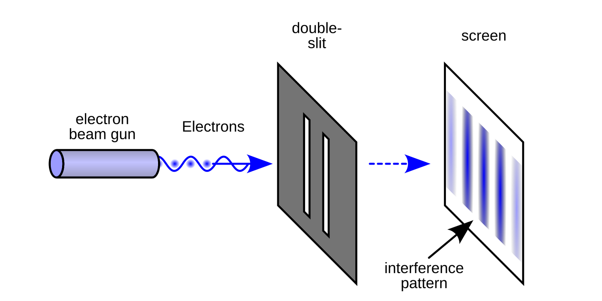

# A Brief Overview of Quantum Mechanics and Its Bizarre Interpretation

In that same Modern Physics book where I first encountered Relativity,
there was another chapter titled Quantum Mechanics. But unlike
Relativity, what I found in this chapter really left me reeling.

While Relativity dealt with large-scale phenomena---high speeds, massive
objects, and cosmic scales---Quantum Mechanics focused on the small,
such as elementary particles.

The brilliant (and delightfully witty) Richard Feynman once said that no
one truly understands Quantum Mechanics, so his audience should forgive
him for not fully grasping the very topic he was teaching. That's quite
a statement---especially from someone who was not only one of the
world's greatest Quantum Mechanics educators, but also a Nobel Prize
winner in the field.

It was also Feynman who said that if you want to understand the
strangeness of quantum mechanics, look no further than the double-slit
experiment. It's a deceptively simple setup that continues to puzzle
scientists --- and illuminate the fundamental weirdness of the quantum
realm.

In early science classes, we're taught that atoms are the basic units of
matter, each one composed of a nucleus orbited by electrons. These
electrons are considered tiny particles, like miniature balls of matter.

Now, imagine a device that can release individual electrons one at a
time. Nearby, there's a detection screen that records where each
electron lands by displaying a small dot. Between the source and the
screen, place a barrier with a narrow opening, such as a single slit.
When an electron passes through the slit, it hits the screen and leaves
a mark. After many electrons are released, you get a concentrated band
of dots aligned with the slit. So far, everything matches our
expectations.

{width="5.833333333333333in"
height="2.9166666666666665in"}

*Double-slit experiment - source: Wikipedia*

Things take a strange turn when a second slit is added.

Intuitively, we'd predict a second band of electrons to appear --- one
behind each slit. But that's not what happens. Instead, the electrons
create a series of alternating bands on the screen, a pattern that looks
eerily like wave interference, not what you'd expect from individual
particles.

This wave-like behavior isn't limited to electrons. Later versions of
the experiment, using atoms and even entire molecules, revealed the same
surprising result. It turns out that everything we consider to be matter
displays wave-like properties under the right conditions. We just don't
see it in daily life because these quantum effects are drowned out at
larger scales.

To appreciate how mind-bending this really is, let's imagine shrinking
ourselves down to the scale of an electron. Picture yourself being fired
from a mysterious quantum launcher toward a screen, with a wall in
between that has two narrow slits.

When only one slit is open, your journey is straightforward: pass
through the slit and leave a mark on the screen behind it.

Now, let's change the conditions slightly --- open the second slit.
Strangely, you still pass through just one of them, but somehow, your
path changes. You no longer head straight through. Instead, you end up
in a new spot on the screen, as if you've somehow sensed the presence of
the second opening and adjusted your trajectory.

But how? How does an electron "know" that the other slit is open?

One tempting explanation is that the electron isn't acting like a
particle at all --- it's behaving like a wave. Interference patterns are
exactly what waves produce when they pass through two openings. But that
explanation opens a new can of worms.

We've never directly seen an "electron wave." Every time we observe an
electron, we detect a tiny speck at a definite location --- never a
diffuse wave spread across space. So, where is this wave, really? Does
it exist physically, or is it just a mathematical abstraction that
describes how the electron behaves?

Physicists tend to lean toward the latter. They describe the behavior of
electrons using a concept called a wave function, which encodes the
probabilities of where the electron might be located. According to this
view, the electron's path isn't determined --- only the likelihood of
where it could end up.

But here's the kicker: when we actually make a measurement, the electron
always shows up at a single point. Not as a blur. Not in two places at
once. Just one spot. This is what's referred to as the "collapse" of the
wave function. All the possibilities suddenly vanish, leaving just one
outcome.

Here we arrive at one of the most perplexing aspects of quantum
mechanics: what exactly causes the wave function to collapse and what
does "collapse" even mean? Despite nearly a century of debate, there's
still no universally accepted answer.

> *The wave function lets physicists calculate the odds of where an
> electron might appear --- but when it comes to pinpointing the exact
> location of a single electron, no one can say for sure until it's
> actually observed.*

This strange mix of probabilities and wave-like behavior isn't just a
quirky detail --- it's a fundamental feature of how particles behave at
the smallest scales. Take an electron. Put it in a tiny, sealed
container, and you might think it's trapped there. But in the quantum
world, things aren't so simple.

Leave the electron alone for a while, and the next time you check,
there's a real chance it won't be in the box anymore. The electron
simply "teleported" out of the box, which can also be interpreted as it
spreading out like a wave and then collapsing into a particle outside
the box. This effect is known as quantum tunneling.

Quantum tunneling isn't just a theoretical curiosity. It's one of the
reasons modern electronics face real limits. As engineers pack
transistors more closely, they eventually reach a point where electrons
start to "leak" through barriers. At that scale, electrons sometimes
jump into nearby transistors. This is why atom-sized transistors cannot
be built; miniaturization encounters obstacles at a larger scale.

Yet, despite its weirdness, quantum mechanics has become one of our most
powerful tools. It has already revolutionized technologies --- from
semiconductors to lasers.

With the help of the wave function, physicists can predict the odds of
where a particle might appear with incredible precision. But for all
this mathematical power, we still don't know what determines where the
particle shows up. What triggers the collapse of the wave function? And
more fundamentally, what is the wave function?

These questions have haunted quantum theory since its earliest days.
Over the decades, physicists and philosophers alike have proposed
various explanations, known collectively as the interpretations of
quantum mechanics.

Among the many attempts to interpret the behavior of quantum physics,
one of the most intuitive is the pilot wave theory, first proposed by
Louis de Broglie and later developed by David Bohm. It suggests that
particles --- like electrons---are still particles, but they travel on
an invisible wave that guides their motion.

This guiding wave doesn't just point the way. It can interfere with
itself or other waves, shaping the paths particles take and giving rise
to patterns like the interference fringes seen in the double-slit
experiment. In this view, electrons aren't behaving like waves ---
they're riding waves.

But here's where things get weird.

The catch is that the guiding wave is non-local, meaning an interaction
with one particle can instantaneously affect another particle, even one
located on the opposite side of the universe. The effect is immediate.
It's as if space, as we understand it, doesn't apply. To fully describe
one particle's state, in principle, you'd need to consider the entire
universe. That's how interconnected everything becomes in this model.

This kind of non-locality --- where distant events seem to influence
each other faster than light --- lies at the heart of quantum theory.
For years, it had been an unsettling theoretical concept. Then, in a
series of ingenious experiments, physicists tested it in the real world.

The basis of the experiment was the EPR paradox, named after Albert
Einstein, Boris Podolsky, and Nathan Rosen. It describes a setup
Einstein hoped would demonstrate that quantum mechanics provides an
incomplete description of reality. He believed local interactions
governed the universe, and that the apparent probabilistic behavior of
quantum systems was merely statistical, emerging from hidden variables
operating under deterministic laws. Einstein famously remarked, "God
does not play dice."

When physicists later built and performed the experiment based on the
proposed setup, the results showed that Einstein was wrong in this case.
The evidence confirmed that quantum mechanics---strange and
uncomfortable as it may seem---is the correct description of how the
world works. Their groundbreaking work earned the 2022 Nobel Prize in
Physics.

The key to these experiments was entanglement. Entanglement means that
once two particles interact, they can no longer be described by separate
wave functions --- only by a single, shared one. Consider two particles
that collide and then bounce off each other in random directions.
According to quantum mechanics, when we measure the direction of one
particle, the wave function collapses, and we obtain a random result.
However, because the law of momentum conservation cannot be violated,
the direction of the other particle must be exactly opposite. A
measurement on one particle instantly determines the outcome for the
other. This is why we say the two particles can no longer be described
by individual wave functions, only by a common one.

Two electrons might be entangled by a property known as spin. While spin
is often described as if the particle were rotating, it's better
understood as a fundamental quantum property --- more like charge or
mass than actual spinning.

An electron's spin can be either "up" or "down," but in an entangled
pair, if one is measured to be "up," the other must be measured to be
"down." However, until a measurement is made, neither particle has a
definite spin. Instead, they exist in a kind of mixed, uncertain state
described by their shared wave function. This state is called
superposition.

You can think of it as the electron being in both the "up" and "down"
states simultaneously until the moment of measurement. Or in this case
--- since we can only talk about the system as a whole --- the two
electrons are simultaneously in the "up--down" and "down--up" states.
The "up--up" and "down--down" combinations are not possible because they
would violate angular momentum conservation.

Let us suppose that a particle's spin is determined by local hidden
variables that are unobservable to us, but by which the spin is, in
fact, predetermined, only unknown to us until the moment of measurement.
In essence, the pilot wave theory is also a hidden variable theory,
though not a local one. Einstein believed in the possibility of a theory
based on local hidden variables, in which particles separated by
light-years could not exert an instantaneous influence on each other. He
assumed that spin has a definite state even before measurement, but that
this state is inaccessible to us. In that case, repeated measurements
would follow a predictable pattern, like flipping a fair coin. But the
results don't match what we'd expect from such local hidden variables.
Instead, they follow a different distribution --- one that only makes
sense if spin isn't determined until the moment of measurement.

To illustrate the idea, imagine you're playing a game with a friend. You
take a coin from your wallet and choose one of the sides---say, heads.
You then hand the coin to your friend and ask them to flip it 100 times
without you watching, and record the results. You'll get one point for
each head, and your friend gets one point for each tail. In reality,
you're trying to test how honest your friend is---but you don't tell
them that.

When the game ends, you notice that tails came up significantly more
often than heads, and your friend wins by a wide margin. You're
suspicious because with a fair coin, the results should be roughly even.
So you figure maybe the coin isn't perfectly balanced. You switch your
choice to tails for the next round, but your friend still wins by a
large margin. At this point, the imbalance theory doesn't hold up
anymore, and you begin to suspect that your friend isn't being honest
about the results. You repeat the game ten more times, and in every
single case, your friend wins by an overwhelming amount. The conclusion
is clear: no fair (or unbalanced) coin could behave this way---your
friend must be lying about the outcomes.

In the EPR experiment, the coin represents the predetermined spin, and
the coin flips correspond to the quantum measurements. If local hidden
variables truly existed, measurement outcomes should follow the
statistics of fair coin tosses. In contrast, at certain orientations,
measurements align with the detector settings more frequently than this
model would allow.

One might suggest that nature favors certain orientations over others
(similarly to the unbalanced coin) ---but when we test those less
favored orientations, we still see the same unexpected results. It's as
if the outcome of a measurement is only decided at the moment the
measurement is made---just as quantum mechanics predicts. And what's
even more surprising: the measurement on one particle seems to
instantaneously determine the state of its partner, even if they are
light-years apart.

This means local realism---the idea that physical properties exist
independently of observation, and that nothing can influence something
else faster than the speed of light---ruled out under reasonable
assumptions. Instead, superposition and non-locality appear to be
fundamental features of reality. This is the phenomenon Einstein
famously called "spooky action at a distance."

Physicists have tried to avoid the unsettling idea of non-locality, but
the alternatives aren't any less bizarre. One of the most striking is
the Many-Worlds Interpretation, first proposed by Hugh Everett. In this
view, the wave function isn't just a mathematical tool --- it's real,
and it never collapses. Instead, every time a measurement is made,
reality splits. One universe branches into many, with each possible
outcome playing out in its own parallel world.

When you measure an electron's spin, the universe doesn't choose just
one result. It chooses all of them, each in a separate universe.
However, each of these universes is only a single perspective on the
underlying reality --- the universe's global wave function, in which all
possible states exist in superposition.

Observers are also part of their universes, and each of them experiences
only their own current universe as real, with no awareness that an
infinite number of their duplicates exist in other universes, each
experiencing their own version as reality. For example, you, dear
reader, who in this universe are reading this book right now, might in
another universe be climbing a mountain, or perhaps you're fleeing from
an enraged dragon on the back of a unicorn. The global wave function is
formed by the entangled wave functions of all particles and represents a
superposition of all possible states.

Although this may sound rather bizarre at first, the Many-Worlds
interpretation is actually quite popular among physicists. This is
because, in this interpretation, the wave function never collapses,
eliminating what many consider the most problematic part of quantum
mechanics. Wave-function collapse only "messes up" and complicates the
mathematical formalism. Once you remove that component, everything
becomes clean, simple, and elegant. The wave function itself is
deterministic, governed by the Schrödinger equation. There are no
troublesome probabilities, and the formalism is simpler (though that
doesn't mean the calculations are easy).

In fact, the Many-Worlds interpretation is what you get when you take
quantum mechanics --- with its wave functions, superpositions, and
entanglement --- completely at face value. You don't need to introduce
new concepts to explain wave-function collapse. The only thing you must
accept is the existence of an ever-growing infinity of parallel worlds.

Despite the idea of infinitely many universes seeming extremely bizarre,
it actually works quite well as a model in practice. Richard Feynman ---
whom we already mentioned in the introduction --- developed his famous
path integral formulation of quantum electrodynamics based on a
similarly mind-bending idea: that a particle like an electron doesn't
take just one path from point A to point B. It explores every possible
path.

To predict where the electron ends up, you don't just trace a straight
line. You consider every imaginable route it could take, assign each a
probability, and add them all together. The interference pattern on the
screen is the result of this sum over an infinite number of
possibilities.

The problem is that there are literally infinitely many paths. Most
physicists would run screaming at the thought of calculating such a
thing. But Feynman wasn't like most people. He found a clever way to
cancel out the infinities and distill something useful --- and
shockingly accurate --- from the math. This method is called
renormalization.

His approach led to quantum electrodynamics (QED), a theory that
explains how light and matter interact with extraordinary precision. It
revolutionized our understanding of atoms, chemical reactions, and the
fundamental workings of the universe. For this, Feynman was awarded the
Nobel Prize in Physics.

But despite his successes, Feynman had little to say about how all this
should be interpreted. In later lectures, he famously admitted that even
he didn't fully understand what quantum mechanics was really saying. The
math worked, but it is "abnormal".

If juggling parallel universes or infinite paths feels too much, there's
another route physicists have explored --- one that's no less
mind-bending: retrocausality.

Retrocausality suggests that effects can happen before their causes. In
plain language, we're talking about a form of time travel, though not
the sci-fi kind with flux capacitors and DeLoreans. Instead of people
moving through time, it's information that travels backward.

This interpretation tries to sidestep the uncomfortable non-locality of
quantum entanglement and the mathematical headaches of infinite
possibilities. Here's how it works: when we measure an electron's spin,
that measurement doesn't just affect the future. It sends a kind of
signal backward through time, reaching all the way back to when the
entangled particles were first created.

The result is that the electron's spin appears to have been "set" in
just the right way from the very beginning, so that when we finally get
around to measuring it, everything lines up exactly as quantum theory
predicts.

Put another way: the electron seems to already know how you're going to
measure it. And it prepares for that outcome before you've even made a
choice.

Thanks to the random behavior of quantum mechanics, this kind of time
travel is free of paradoxes, since we have no influence over the
information that travels backward in time.

It's a deeply unsettling idea. Whether nature actually works this way
remains up for debate, but it shows just how far we're willing to
stretch our understanding of time, causality, and reality to make sense
of the quantum world.

Still not sold on retrocausality and quantum time-travel? There's one
more interpretation physicists have considered --- one that sounds
surprisingly simple at first, but comes with an unsettling cost:
superdeterminism.

At the heart of the experiments that confirmed quantum non-locality is a
crucial assumption --- that the measurement settings (the way scientists
configure their detectors) are chosen freely and randomly, like rolling
a die. Superdeterminism throws that assumption. It says there is no
randomness.

According to this view, the universe is entirely deterministic.
Everything that happens --- from the spin of an electron to the way a
physicist tweaks a dial on a detector --- was already determined from
the very beginning. Everything was written into the fabric of reality at
the moment of the Big Bang.

Under superdeterminism, there's no need for spooky faster-than-light
signals or bizarre temporal loops. No infinite paths, no collapsing wave
functions. The strange statistical outcomes of quantum experiments are
all pre-programmed. The universe simply unfolds, following a script
written at the dawn of time.

Mathematically, it works. You don't need probabilities, and it doesn't
cause paradoxes. The equations align beautifully. But it comes at a high
cost.

For this to be true, the entire Universe would have to be fine-tuned
with unimaginable precision. Not just particles and stars, but your
neurons in your brain, your thoughts, your decisions --- everything
would have to follow the script. Even the act of setting up a "random"
measurement is only random in appearance. Behind the curtain, it was
inevitable all along.

According to superdeterminism, no matter what method physicists devise
to perform random measurements, they will always end up with statistics
consistent with quantum mechanics. The reason, it claims, is that those
seemingly random choices were in fact predetermined at the birth of the
universe---arranged in such a peculiar way that they inevitably produce
quantum-mechanical statistics.

It's a bit like testing the harmful effects of smoking on mice. We split
the mice into two groups at random (say, by flipping a fair coin). One
group is exposed to cigarette smoke, while the other is not. At the end
of the experiment, a higher proportion of the smoke-exposed mice
developed cancer compared to the control group. From this, we conclude
that cigarette smoke causes cancer.

Now imagine a superdeterminist lawyer working for the tobacco industry.
He argues that the result is invalid because the selection was
biased---the first group just happened to be more prone to cancer from
the outset. So, we repeat the experiment ten more times, and each time
we get a similar result. Still, the lawyer insists that no matter what
method you use to divide the mice, the ones predisposed to cancer will
always end up in the smoke-exposed group, because somehow the universe
is wired that way.

This line of reasoning isn't illogical, but let's be honest, it's pretty
strange.

And here's the kicker: if superdeterminism is right, then free will is
an illusion. Every choice you think you're making was prewritten. Every
decision, every moment of doubt, every burst of inspiration --- they
were all part of the plan.

Fortunately, it isn't so easy to get rid of free will. In 1814,
Pierre-Simon Laplace proposed a thought experiment: if a hypothetical
superintelligence---Laplace's demon---knew the exact position and
momentum of every particle in the universe, then according to the laws
of classical mechanics, it could predict the future for any length of
time. In doing so, it would dethrone God and deprive humans of free
will.

Even under superdeterminism, the state of particles can only be known to
a limited extent (there exist "hidden variables"). This means Laplace's
demon could never truly predict the future, since it can never know both
the exact position and momentum of all particles in the universe
simultaneously. Thus, a realm of the unknown may still remain---for God
and for free will.

Of course, according to superdeterminism, even these hidden variables
follow deterministic laws. But such a claim can neither be proven nor
refuted.

If we're not ready to give up on free will --- or accept a universe
completely scripted from the start --- we eventually circle back to the
most famous interpretation of them all: the so-called Copenhagen
interpretation.

According to this view, the wave function does collapse --- but only
when a measurement is made. The act of observation isn't just passive;
it plays a critical role in deciding the outcome.

But here's the problem: what exactly counts as a "measurement"? After
all, measuring devices are made of atoms. They follow the same quantum
rules as everything else. So, how can they collapse a wave function if
they're also part of the quantum system?

This problem, and the absurdity of the Copenhagen interpretation of
quantum mechanics, is highlighted by Erwin Schrödinger's famous thought
experiment with the cat.

Imagine placing a cat inside a sealed box along with a vial of poison
and a device that will break the vial if a certain quantum event
occurs---for example, the decay of an atomic nucleus. If the vial
breaks, the cat dies; if it does not, the cat survives. Nuclear decay is
governed by the laws of quantum mechanics. We can predict its
probability, but we cannot know exactly when it will happen.

According to the Copenhagen interpretation, as long as no observation is
made of the decaying nucleus, it remains in a superposition--- meaning
it is, in a sense, both decayed and not decayed at the same time. But
since the device and the vial are also made of atoms, they too must be
in superposition. And, by extension, the cat inside the box must
likewise be in a superposition---both alive and dead---until someone
opens the box to make an observation. Schrödinger's famous cat is a kind
of quantum living dead.

Some versions of the Copenhagen interpretation suggest that what really
causes the collapse isn't the measuring device --- it's the conscious
observer. In other words, reality becomes definite only when it enters
the mind of someone observing it.

This idea was seriously considered by Nobel Prize--winning physicist
Eugene Wigner. He proposed that consciousness might be a fundamental
component of the universe --- something that can't be reduced to
physical interactions alone. Wigner even speculated that we might need
to return to a kind of dualism, where mind and matter are distinct,
coexisting layers of reality.

Wigner also proposed a famous thought experiment, known as Wigner's
Friend. It is essentially an extension of Schrödinger's thought
experiment. This time, the box containing the cat---and the scientist
who opens it (Wigner's friend)---are both placed inside a sealed room,
which Wigner himself observes from the outside.

As long as Wigner does not open the door, the entire system---including
the scientist---remains in superposition from his perspective. But what
happens when the scientist opens the box and finds either a living or a
dead cat? For the scientist, the wave function collapses at that moment.
For Wigner, however, it does not. Thus, the wave function itself would
have to be both in a collapsed and non-collapsed state at the same
time---a contradiction even within quantum mechanics.

From this, Wigner concluded that describing systems in a way that treats
conscious observers as if they too could exist in superposition is
incorrect. But this raises a further question: who exactly counts as a
conscious observer? Is Wigner's friend one? And the cat cannot be one?
Or perhaps poor Wigner is actually completely alone---and he is the only
conscious observer in the entire universe?

A special version of the conscious observer interpretation is the
participatory universe concept proposed by John Archibald Wheeler.
According to this idea, the universe evolved according to its wave
function until consciousness emerged through the process of evolution.
Once conscious observers appeared, the universe's wave function began to
collapse---not only toward the future, but also backward in time.

In this view, galaxies that have existed for billions of years only came
into existence as definite particles (rather than as wave functions)
when we observed them through our telescopes. Even the Big Bang itself
happened---as Wheeler suggests---because we began measuring the cosmic
microwave background radiation. This act of observation caused the
universe's wave function to collapse retroactively, all the way back to
the beginning of time.

It's a truly bizarre concept---complete with consciousness,
retrocausality, and all the mind-bending elements one could ask for.

Einstein and Schrödinger were among the few physicists who still
believed in the existence of an objective reality. This belief is
reflected in one of Einstein's famous questions, which he posed to
Abraham Pais during a walk: "Do you really believe the moon is not there
when you are not looking at it?"

Interpretations involving conscious observers can indeed lead to strange
and unsettling conclusions. However, they are fully consistent with the
rules of quantum mechanics and experimental observations. And given that
many of the alternative interpretations are equally bizarre, we can't
simply dismiss this one either.

If none of the interpretations we've explored feel satisfying, there are
plenty more. A quick glance at Wikipedia reveals a whole gallery of
alternative quantum interpretations, each one stranger than the last.

That's the nature of the beast. Quantum mechanics isn't just
counterintuitive --- it's radically disconnected from anything we
experience in daily life. Our brains evolved to make sense of apples
falling from trees and rocks skipping across ponds, not particles that
exist in multiple states or influence each other across light-years.

When Einstein introduced Relativity, it challenged our sense of time and
space --- but it gave us a beautiful picture in return: a new definition
of time and space that bends under the weight of matter. It was weird,
sure, but we could still picture it; but quantum mechanics doesn't offer
that luxury.
